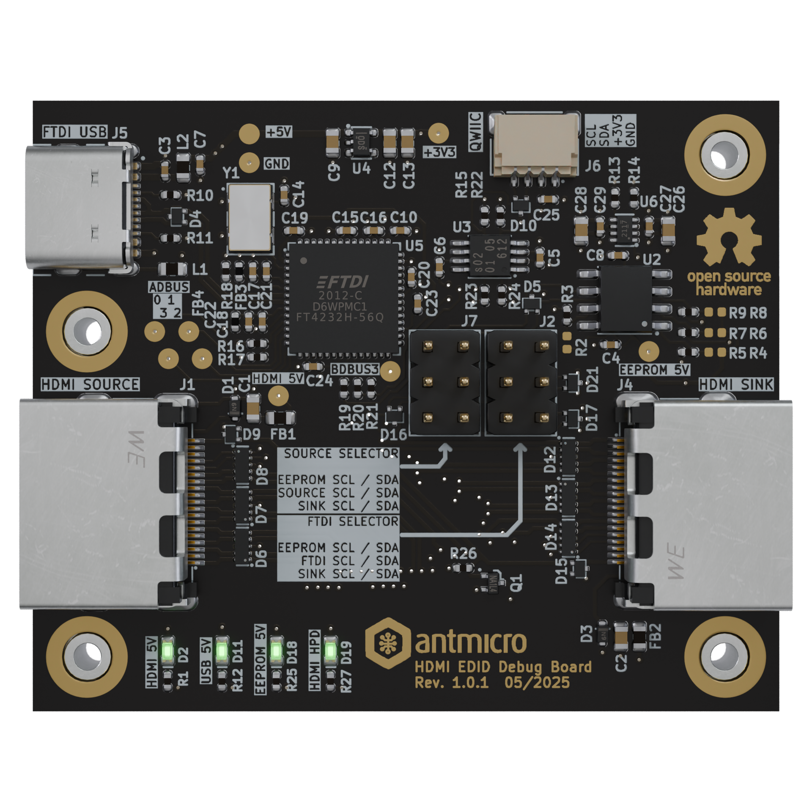

# HDMI EDID Debug Board

Copyright (c) 2025 [Antmicro](https://www.antmicro.com)

## Overview

This project contains PCB design files for a board that allows to intercept, inject and replace EDID profile advertised to HDMI video source.
The board can be used for debugging, integration, troubleshooting of advanced video systems that utilize HDMI as video transmission standard. 

The PCB design files were prepared in KiCad 8.x.

## Key features

* HDMI passthrough
  * LVDS, CEC, HPD, UTIL and 5V are passed through the board
  * I2C connection can be changed by selector configuration
* LED indicators
  * HPD
* HDMI power
  * USB power
  * EEPROM power
* EDID Selectors (goldpins with jumpers / slide switches)
  * HDMI Source I2C can be connected to HDMI Sink, EEPROM or disconnected
  * FTDI I2C and QWIIC Connector can be connected to HDMI Sink, EEPROM or disconnected
* EDID EEPROM
  * 2kb
  * Default 7-bit I2C address: `0x50`
* USB-C Connector and on-board USB-to-I2C bridge (FTDI FT4232H-56Q)
  * Can be used to dump data from the HDMI sink or upload it to the on-board EEPROM
* Power Mux
  * EDID EEPROM can be powered either from HDMI source or USB-C

## Project structure

The main directory contains KiCad PCB project files, a LICENSE and a README.
The remaining files are stored in the following directories:

* `doc` - contains board schematics in PDF format
* `assets` - contains visual assets for showcasing this design on [Open Hardware Portal](https://openhardware.antmicro.com)

## Licensing

This project is published under the [Apache-2.0](LICENSE) license.
